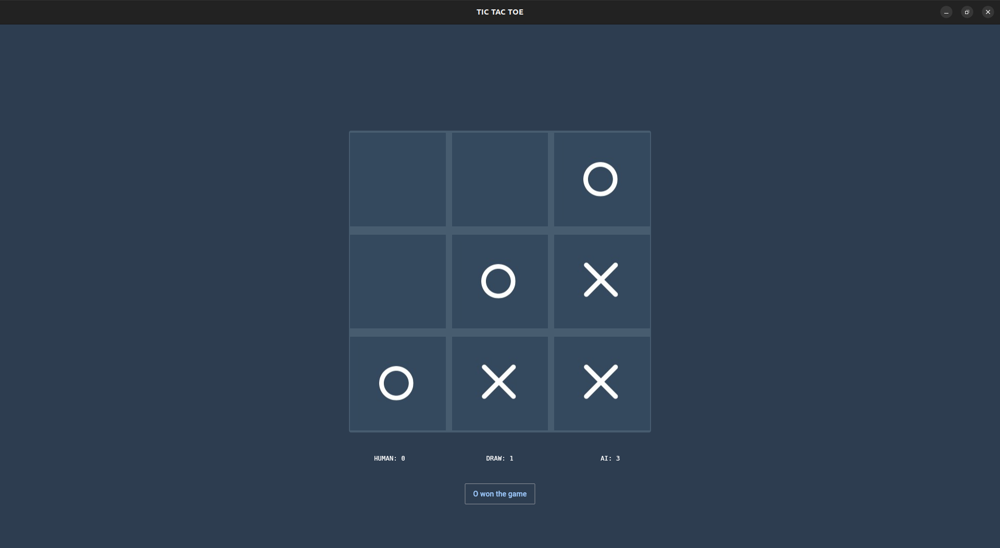

# TIC-TAC-TOE
unbeatable tic tac toe game AI  created using the minimax algorithm.  
GUI made using flet library [flutter with python]

## how to play
- clone this repo to your local machine by typing `git clone [url_in_your_search_bar]`
- install flet via `pip install flet`
- cd into the repo you cloned
- run `python3 game_gui.py`
- loose over and over :)

